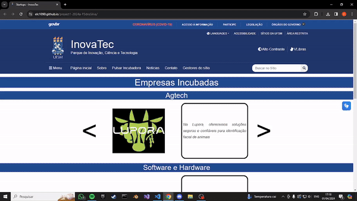

# Projeto: Remake de site/app web

> 1. Baixe este arquivo e edite o texto em formato Markdown conforme as instruções a seguir.
> 2. Substitua todos os trechos de texto iniciados com "Substitua" por informações do seu projeto, conforme solicitado em cada trecho.
> 3. Substitua a imagem por um screenshot do projeto (arquivo pode ser armazenado no repositório ou em URL externa). GIFs animados também são permitidos!
> 4. Remova todas as instruções de entrega.
> 5. Double-check: Certifique-se de que seu README.md não contenha instruções de entrega!
> 6. Entregue este README.md dentro da pasta raiz do seu repositório de entrega. Peça ajuda se não souber como editar ou entregar!
> Opcional: você pode alterar a formatação do README, mas mantenha todas as informações solicitadas

Acesso: [Substitua este texto pela URL para acesso ao site publicado](https://elc1090.github.io/project1-2024a-P3droSilva/)

#### Desenvolvedor(a)
Pedro Henrique da Silva Hinerasky - CC

#### Site/app escolhido

##### Link
[Substitua este texto pela URL do site/app escolhido](https://www.ufsm.br/orgaos-suplementares/inovatec/startups)

##### Descrição
O site escolhido apresenta uma lista de sites de empresas incubadas na UFSM. O site no entanto, apenas apresenta a logo de tais sites, sem apresentar nada sobre a empresa em si.

#### Desenvolvimento

Inicialmente, copiei o header e footer do site original, para manter a identidade de um site da UFSM. Em sequência, decidi por criar carrosséis para cada categoria de empresa, o que daria um enfoque para cada empresa separadamente, dando a possibilidade de colocar uma breve descrição da mesma. Inicialmente, coletei as imagens dos logos das empresas, bem como seus links para sites e redes sociais. Com isso, pude descartar empresas que aparentam não existir mais. Logo, criei 3 carrosséis diferentes, utilizando um script em JavaScript. Após isso, implementei a a possibilidade de pausar o andamento do carrossel colocando o cursor do mouse sobre a imagem da empresa. Por fim, implementei botões para avançar e voltar pelo carrossel.

#### Tecnologias

- HTML
- CSS
- Script em JavaScript dentro do HTML

#### Ambiente de desenvolvimento

- VsCode
- Extensões de HTML e CSS
- Extensão LiveShare

#### Referências e créditos

- Header e Footer do site original da UFSM
- Prompts do ChatGPT para ajudar na geração dos códigos em JavaScript para os carrosséis e botões

---
Projeto entregue para a disciplina de [Desenvolvimento de Software para a Web](http://github.com/andreainfufsm/elc1090-2024a) em 2024a
